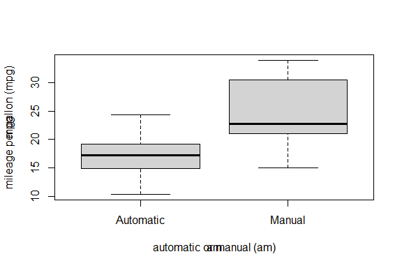
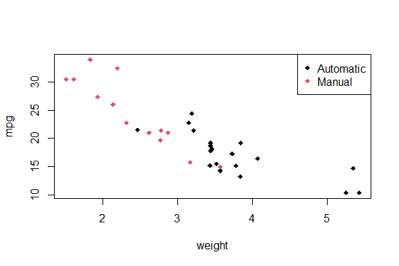
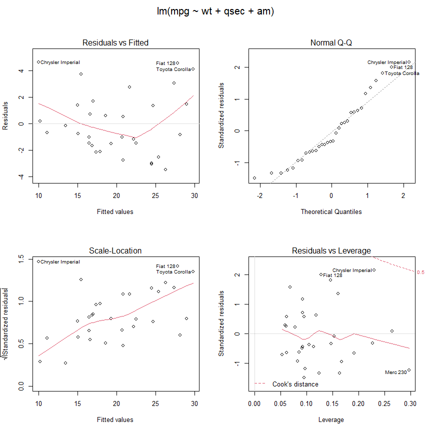

Course Project - Regression Models

## Executive Summary

**Motor Trend Car Road Tests**, namely dataset “**mtcars**” exploited in
this work was originally collected the *Motor Trend* US Magazine since
1974.

    ## Example of data records
    head(mtcars, 3)

    ##                mpg cyl disp  hp drat    wt  qsec vs am gear carb
    ## Mazda RX4     21.0   6  160 110 3.90 2.620 16.46  0  1    4    4
    ## Mazda RX4 Wag 21.0   6  160 110 3.90 2.875 17.02  0  1    4    4
    ## Datsun 710    22.8   4  108  93 3.85 2.320 18.61  1  1    4    1

Looking at a data set of a collection of cars, two questions are highly
interested in exploring the relationship between a set of variables and
miles per gallon (MPG) (outcome).

1.  **“Is an automatic or manual transmission better for MPG ?”**

As the first attempt to explore the data,

    ## average mpg of all automatic transmission typed(am=0) cars
    avg_a = mean( mtcars[ mtcars$am == 0, "mpg" ] )
    avg_a

    ## [1] 17.14737

    ## avarge mpg of all manual transmission typed(am=1) cars
    avg_m = mean( mtcars[ mtcars$am == 1, "mpg" ] )
    avg_m

    ## [1] 24.39231

This shows at average cars with manual transmission have 7.2449393
mileage per gallon more than those with automatic transmission.

1.  **“Quantify the MPG difference between automatic and manual
    transmissions”**

The linear regression model, described in later sections of this work,
can quantify the difference more closely.

## Clean Data

Those variables with integer values are better as factor formatted.

    mydata <- mtcars

    mydata$cyl <- as.factor(mydata$cyl)
    mydata$vs <- as.factor(mydata$vs)
    mydata$gear <- as.factor(mydata$gear)
    mydata$carb <- as.factor(mydata$carb)
    mydata$am <- as.factor(mydata$am)

And the “am” variable is assigned with meaningful labels

    levels(mydata$am) <- c('Automatic','Manual')

### T-test

Applying T-Test shows clearly that the manual and automatic are
statistically significant different. “Null Hypothesis”: true difference
in two group “manual” and “automatic” equals to 0

    t_res <- t.test(mpg ~ am, data=mydata)
    t_res$p.value

    ## [1] 0.001373638

The P-value is so small that the “Null Hypothesis” will be rejected.

## Linear Regression Model

### Selection

To find the regression model with only really confounding variables, in
other words, to avoid over-fitting by including all variables, the
Bayesian Information Criteria (BIC) algorithm is applied. For more
information about BIC, see the article at
<http://en.wikipedia.org/wiki/Bayesian_information_criterion> .

    model.all <- lm(mpg ~ ., data = mydata)
    n <- nrow(mydata)
    ## Stepwise Algorithm
    model.new <- step(model.all, direction = "both", k = log(n))

    summary(model.new)$coefficients

    ##              Estimate Std. Error   t value     Pr(>|t|)
    ## (Intercept)  9.617781  6.9595930  1.381946 1.779152e-01
    ## wt          -3.916504  0.7112016 -5.506882 6.952711e-06
    ## qsec         1.225886  0.2886696  4.246676 2.161737e-04
    ## amManual     2.935837  1.4109045  2.080819 4.671551e-02

The result suggests the combinations of 3 predictors: “wt”, “qsec” and
“am”. See the Figure 2.

Now compare the difference among models more with “anova” method.

    anova <- anova(lm(mpg ~ am, data = mydata), 
                   lm(mpg ~ am + wt, data = mydata),
                   model.new )

    cbind(anova[1], anova[2], anova[3], anova[4], anova[5], anova[6])

    ##   Res.Df      RSS Df Sum of Sq        F       Pr(>F)
    ## 1     30 720.8966 NA        NA       NA           NA
    ## 2     29 278.3197  1  442.5769 73.20250 2.672820e-09
    ## 3     28 169.2859  1  109.0338 18.03425 2.161737e-04

It shows that by including new variables “wt” and “qsec” into the “lm”
formula, the fitness of regression model gets improved because the
Residuals Sum of Square (RSS) decreases steadily.

And fitted model parameters

    ## 
    ## Call:
    ## lm(formula = mpg ~ wt + qsec + am, data = mydata)
    ## 
    ## Coefficients:
    ## (Intercept)           wt         qsec     amManual  
    ##       9.618       -3.917        1.226        2.936

indicate that, regard to the predicated mileage, the coefficient on “wt
– Weight(1000/lb)” with value -3.9165037 has even larger impact than the
coefficient on “am” with value 2.9358372. With other words, the
“transmission type” is not be the most decisive factor for the purpose
of saving fuel cost.

### Residuals

Based on the Figure 3 in the Appendix

-   The Residuals vs Fitted plot seem to verify the independence
    assumption as the points are randomly scattered on the plot.

-   The Residuals and Leverage plot indicates no leverage detected as
    all points fall inside the bounds.

### Diagnostics

Find out those highly influential “cars” in the “mtcars” datasets.

    influentialPoints <- apply( influence.measures(model.new)$is.inf, 1, sum)>0
    row.names(mydata[influentialPoints,])

    ## [1] "Cadillac Fleetwood"  "Lincoln Continental" "Chrysler Imperial"

## Conclusion

To the end, after developing a linear regression model, the question
about the difference of mpg(outcome) due to “transmission type” has its
clear answer. One **uncertainty**, look at the Figure 2, almost all
automatic cars have light weight than cars with manual transmission so
the original dataset is not well unbiased to study the “mpg”.

## Appendix

**Figure 1. mpg vs transimission type**

**Figure 2. mpg vs. wt by transmission type**

**Figure 3. Model Analysis**

