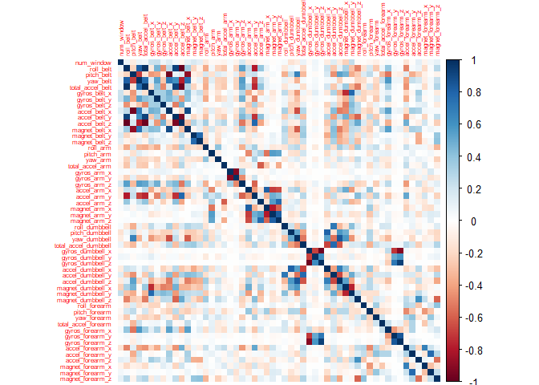
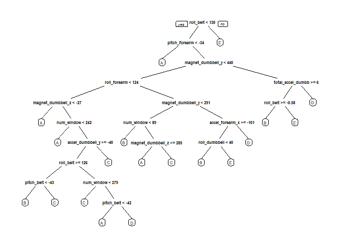

# Practical Machine Learning Course Project Report

## Background

Using devices such as Jawbone Up, Nike FuelBand, and Fitbit it is now
possible to collect a large amount of data about personal activity
relatively inexpensively. These type of devices are part of the
quantified self movement - a group of enthusiasts who take measurements
about themselves regularly to improve their health, to find patterns in
their behavior, or because they are tech geeks. One thing that people
regularly do is quantify how much of a particular activity they do, but
they rarely quantify how well they do it. In this project, our goal will
be to use data from accelerometers on the belt, forearm, arm, and
dumbell of 6 participants. They were asked to perform barbell lifts
correctly and incorrectly in 5 different ways. More information is
available from the website here:
<http://groupware.les.inf.puc-rio.br/har> (see the section on the Weight
Lifting Exercise Dataset).

## Data Sources

The training data for this project is available here:  
<https://d396qusza40orc.cloudfront.net/predmachlearn/pml-training.csv>  
The test data is available here:  
<https://d396qusza40orc.cloudfront.net/predmachlearn/pml-testing.csv>  
The data for this project comes from this original source:
<http://groupware.les.inf.puc-rio.br/har>. If you use the document you
create for this class for any purpose please cite them as they have been
very generous in allowing their data to be used for this kind of
assignment.

## Intended Results

The goal of this project is to predict the manner in which they did the
exercise. This is the “classe” variable in the training set. You may use
any of the other variables to predict with. You should create a report
describing how you built your model, how you used cross validation, what
you think the expected out of sample error is, and why you made the
choices you did. You will also use your prediction model to predict 20
different test cases.  
1. Your submission should consist of a link to a Github repo with your R
markdown and compiled HTML file describing your analysis. Please
constrain the text of the writeup to &lt; 2000 words and the number of
figures to be less than 5. It will make it easier for the graders if you
submit a repo with a gh-pages branch so the HTML page can be viewed
online (and you always want to make it easy on graders :-).  
2. You should also apply your machine learning algorithm to the 20 test
cases available in the test data above. Please submit your predictions
in appropriate format to the programming assignment for automated
grading. See the programming assignment for additional details.

## Reproducibility

In order to reproduce the same results, you need a certain set of
packages as well as setting a pseudo random seed equal to the one I have
used.  
`Note`: To install, for instance, the `rattle` package in R, run this
command: `install.packages("rattle")`.  
The following Libraries were used for this project, which you should
install and load them in your working environment.

    library(rattle)

    ## Loading required package: tibble

    ## Loading required package: bitops

    ## Rattle: A free graphical interface for data science with R.
    ## Version 5.4.0 Copyright (c) 2006-2020 Togaware Pty Ltd.
    ## Type 'rattle()' to shake, rattle, and roll your data.

    library(caret)

    ## Loading required package: lattice

    ## Loading required package: ggplot2

    library(rpart)
    library(rpart.plot)
    library(corrplot)

    ## corrplot 0.84 loaded

    library(randomForest)

    ## randomForest 4.6-14

    ## Type rfNews() to see new features/changes/bug fixes.

    ## 
    ## Attaching package: 'randomForest'

    ## The following object is masked from 'package:ggplot2':
    ## 
    ##     margin

    ## The following object is masked from 'package:rattle':
    ## 
    ##     importance

    library(RColorBrewer)

Finally, load the same seed with the following line of code:

    set.seed(56789)

## Getting Data

The following code fragment downloads the dataset to the `data` folder
in the current working directory.

    trainUrl <-"https://d396qusza40orc.cloudfront.net/predmachlearn/pml-training.csv"
    testUrl <- "https://d396qusza40orc.cloudfront.net/predmachlearn/pml-testing.csv"
    trainFile <- "./data/pml-training.csv"
    testFile  <- "./data/pml-testing.csv"
    if (!file.exists("./data")) {
      dir.create("./data")
    }
    if (!file.exists(trainFile)) {
      download.file(trainUrl, destfile = trainFile, method = "curl")
    }
    if (!file.exists(testFile)) {
      download.file(testUrl, destfile = testFile, method = "curl")
    }
    rm(trainUrl)
    rm(testUrl)

## Reading Data

After downloading the data from the data source, we can read the two csv
files into two data frames.

    trainRaw <- read.csv(trainFile)
    testRaw <- read.csv(testFile)
    dim(trainRaw)

    ## [1] 19622   160

    dim(testRaw)

    ## [1]  20 160

    rm(trainFile)
    rm(testFile)

The training data set contains 19622 observations and 160 variables,
while the testing data set contains 20 observations and 160 variables.
The `classe` variable in the training set is the outcome to predict.

## Cleaning Data

In this step, we will clean the dataset and get rid of observations with
missing values as well as some meaningless variables.

1.  We clean the <b>Near Zero Variance</b> Variables.

<!-- -->

    NZV <- nearZeroVar(trainRaw, saveMetrics = TRUE)
    head(NZV, 20)

    ##                        freqRatio percentUnique zeroVar   nzv
    ## X                       1.000000  100.00000000   FALSE FALSE
    ## user_name               1.100679    0.03057792   FALSE FALSE
    ## raw_timestamp_part_1    1.000000    4.26562022   FALSE FALSE
    ## raw_timestamp_part_2    1.000000   85.53154622   FALSE FALSE
    ## cvtd_timestamp          1.000668    0.10192641   FALSE FALSE
    ## new_window             47.330049    0.01019264   FALSE  TRUE
    ## num_window              1.000000    4.37264295   FALSE FALSE
    ## roll_belt               1.101904    6.77810621   FALSE FALSE
    ## pitch_belt              1.036082    9.37722964   FALSE FALSE
    ## yaw_belt                1.058480    9.97349913   FALSE FALSE
    ## total_accel_belt        1.063160    0.14779329   FALSE FALSE
    ## kurtosis_roll_belt   1921.600000    2.02323922   FALSE  TRUE
    ## kurtosis_picth_belt   600.500000    1.61553358   FALSE  TRUE
    ## kurtosis_yaw_belt      47.330049    0.01019264   FALSE  TRUE
    ## skewness_roll_belt   2135.111111    2.01304658   FALSE  TRUE
    ## skewness_roll_belt.1  600.500000    1.72255631   FALSE  TRUE
    ## skewness_yaw_belt      47.330049    0.01019264   FALSE  TRUE
    ## max_roll_belt           1.000000    0.99378249   FALSE FALSE
    ## max_picth_belt          1.538462    0.11211905   FALSE FALSE
    ## max_yaw_belt          640.533333    0.34654979   FALSE  TRUE

    training01 <- trainRaw[, !NZV$nzv]
    testing01 <- testRaw[, !NZV$nzv]
    dim(training01)

    ## [1] 19622   100

    dim(testing01)

    ## [1]  20 100

    rm(trainRaw)
    rm(testRaw)
    rm(NZV)

1.  Removing some columns of the dataset that do not contribute much to
    the accelerometer measurements.

<!-- -->

    regex <- grepl("^X|timestamp|user_name", names(training01))
    training <- training01[, !regex]
    testing <- testing01[, !regex]
    rm(regex)
    rm(training01)
    rm(testing01)
    dim(training)

    ## [1] 19622    95

    dim(testing)

    ## [1] 20 95

1.  Removing columns that contain `NA's`.

<!-- -->

    cond <- (colSums(is.na(training)) == 0)
    training <- training[, cond]
    testing <- testing[, cond]
    rm(cond)

Now, the cleaned training data set contains 19622 observations and 54
variables, while the testing data set contains 20 observations and 54
variables.

Correlation Matrix of Columns in the Training Data set.

    corrplot(cor(training[, -length(names(training))]), method = "color", tl.cex = 0.5)

## Partitioning Training Set

we split the cleaned training set into a pure training data set (70%)
and a validation data set (30%). We will use the validation data set to
conduct cross validation in future steps.

    set.seed(56789) # For reproducibile purpose
    inTrain <- createDataPartition(training$classe, p = 0.70, list = FALSE)
    validation <- training[-inTrain, ]
    training <- training[inTrain, ]
    rm(inTrain)

The Dataset now consists of 54 variables with the observations divided
as following:  
1. Training Data: 13737 observations.  
2. Validation Data: 5885 observations.  
3. Testing Data: 20 observations.

## Data Modelling

### Decision Tree

We fit a predictive model for activity recognition using <b>Decision
Tree</b> algorithm.

    modelTree <- rpart(classe ~ ., data = training, method = "class")
    prp(modelTree)

Now, we estimate the performance of the model on the <b>validation</b>
data set.

    predictTree <- predict(modelTree, validation, type = "class")
    confusionMatrix(as.factor(validation$classe), predictTree)

    ## Confusion Matrix and Statistics
    ## 
    ##           Reference
    ## Prediction    A    B    C    D    E
    ##          A 1492   37   10   84   51
    ##          B  270  551  120  134   64
    ##          C   55   32  818   49   72
    ##          D  116   17  117  655   59
    ##          E   84   89   61  140  708
    ## 
    ## Overall Statistics
    ##                                           
    ##                Accuracy : 0.7178          
    ##                  95% CI : (0.7061, 0.7292)
    ##     No Information Rate : 0.3427          
    ##     P-Value [Acc > NIR] : < 2.2e-16       
    ##                                           
    ##                   Kappa : 0.6409          
    ##                                           
    ##  Mcnemar's Test P-Value : < 2.2e-16       
    ## 
    ## Statistics by Class:
    ## 
    ##                      Class: A Class: B Class: C Class: D Class: E
    ## Sensitivity            0.7397  0.75895   0.7265   0.6168   0.7421
    ## Specificity            0.9529  0.88602   0.9563   0.9359   0.9242
    ## Pos Pred Value         0.8913  0.48376   0.7973   0.6795   0.6543
    ## Neg Pred Value         0.8753  0.96313   0.9366   0.9173   0.9488
    ## Prevalence             0.3427  0.12336   0.1913   0.1805   0.1621
    ## Detection Rate         0.2535  0.09363   0.1390   0.1113   0.1203
    ## Detection Prevalence   0.2845  0.19354   0.1743   0.1638   0.1839
    ## Balanced Accuracy      0.8463  0.82249   0.8414   0.7763   0.8331

    accuracy <- postResample(predictTree, as.factor(validation$classe))
    ose <- 1 - as.numeric(confusionMatrix(as.factor(validation$classe), predictTree)$overall[1])
    rm(predictTree)
    rm(modelTree)

The Estimated Accuracy of the Random Forest Model is 71.7757009% and the
Estimated Out-of-Sample Error is 28.2242991%.

### Random Forest

We fit a predictive model for activity recognition using <b>Random
Forest</b> algorithm because it automatically selects important
variables and is robust to correlated covariates & outliers in
general.  
We will use <b>5-fold cross validation</b> when applying the algorithm.

    modelRF <- train(classe ~ ., data = training, method = "rf", trControl = trainControl(method = "cv", 5), ntree = 50, maxdepth = 20)
    modelRF

    ## Random Forest 
    ## 
    ## 13737 samples
    ##    53 predictor
    ##     5 classes: 'A', 'B', 'C', 'D', 'E' 
    ## 
    ## No pre-processing
    ## Resampling: Cross-Validated (5 fold) 
    ## Summary of sample sizes: 10988, 10990, 10991, 10990, 10989 
    ## Resampling results across tuning parameters:
    ## 
    ##   mtry  Accuracy   Kappa    
    ##    2    0.9917018  0.9895015
    ##   27    0.9965791  0.9956728
    ##   53    0.9941038  0.9925418
    ## 
    ## Accuracy was used to select the optimal model using the largest value.
    ## The final value used for the model was mtry = 27.

Now, we estimate the performance of the model on the <b>validation</b>
data set.

    predictRF <- predict(modelRF, validation)
    confusionMatrix(as.factor(validation$classe), predictRF)

    ## Confusion Matrix and Statistics
    ## 
    ##           Reference
    ## Prediction    A    B    C    D    E
    ##          A 1674    0    0    0    0
    ##          B    2 1134    2    1    0
    ##          C    0    1 1025    0    0
    ##          D    0    0    0  964    0
    ##          E    0    0    0    1 1081
    ## 
    ## Overall Statistics
    ##                                           
    ##                Accuracy : 0.9988          
    ##                  95% CI : (0.9976, 0.9995)
    ##     No Information Rate : 0.2848          
    ##     P-Value [Acc > NIR] : < 2.2e-16       
    ##                                           
    ##                   Kappa : 0.9985          
    ##                                           
    ##  Mcnemar's Test P-Value : NA              
    ## 
    ## Statistics by Class:
    ## 
    ##                      Class: A Class: B Class: C Class: D Class: E
    ## Sensitivity            0.9988   0.9991   0.9981   0.9979   1.0000
    ## Specificity            1.0000   0.9989   0.9998   1.0000   0.9998
    ## Pos Pred Value         1.0000   0.9956   0.9990   1.0000   0.9991
    ## Neg Pred Value         0.9995   0.9998   0.9996   0.9996   1.0000
    ## Prevalence             0.2848   0.1929   0.1745   0.1641   0.1837
    ## Detection Rate         0.2845   0.1927   0.1742   0.1638   0.1837
    ## Detection Prevalence   0.2845   0.1935   0.1743   0.1638   0.1839
    ## Balanced Accuracy      0.9994   0.9990   0.9989   0.9990   0.9999

    accuracy <- postResample(predictRF, as.factor(validation$classe))
    ose <- 1 - as.numeric(confusionMatrix(as.factor(validation$classe), predictRF)$overall[1])
    rm(predictRF)

The Estimated Accuracy of the Random Forest Model is 99.8810535% and the
Estimated Out-of-Sample Error is 0.1189465%.  
Random Forests yielded better Results, as expected!

## Predicting The Manner of Exercise for Test Data Set

Now, we apply the <b>Random Forest</b> model to the original testing
data set downloaded from the data source. We remove the problem\_id
column first.

    data.frame(question = seq(20)
               ,pred = predict(modelRF, testing[, -length(names(testing))]))

    ##    question pred
    ## 1         1    B
    ## 2         2    A
    ## 3         3    B
    ## 4         4    A
    ## 5         5    A
    ## 6         6    E
    ## 7         7    D
    ## 8         8    B
    ## 9         9    A
    ## 10       10    A
    ## 11       11    B
    ## 12       12    C
    ## 13       13    B
    ## 14       14    A
    ## 15       15    E
    ## 16       16    E
    ## 17       17    A
    ## 18       18    B
    ## 19       19    B
    ## 20       20    B
